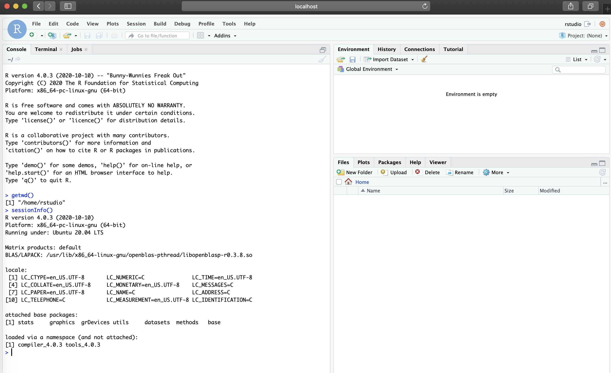
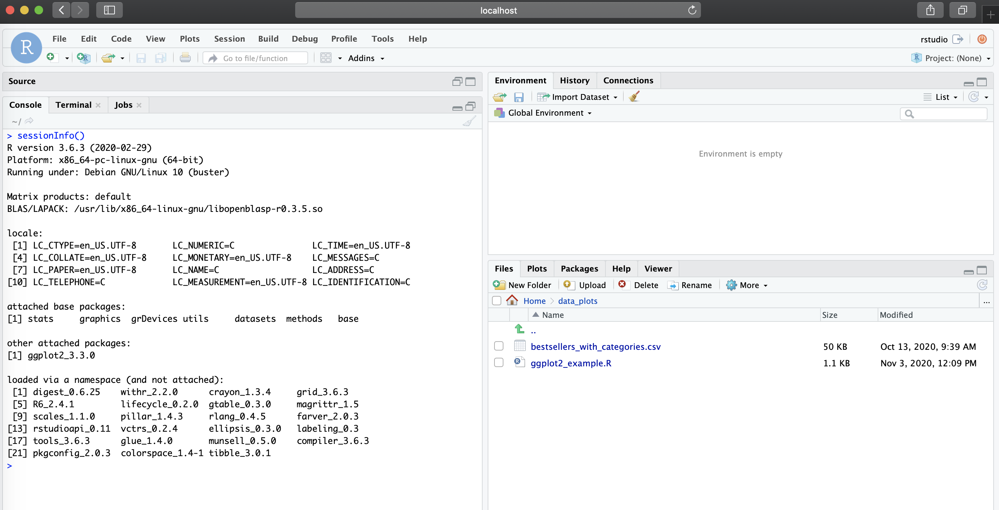

# Requirements

* Have Docker installed in your computer - see https://docs.docker.com/get-docker/
* Recommended, but not required: "Get Started" material by Docker: https://docs.docker.com/get-started/

# Overview

Reproducibility is a key component to scientific advancement, and in computational biology this should include the following components:

* __Good documentation__ - no matter how good of a software/app/pipeline you develop, the lack of proper document hinders your science. Thus, document and update as necessary.
* __Version control of code__ - familiarity with the concept of version control using `git` and web-bases git services (e.g.: GitLab, GitHub, Bitbucket) is a crucial component to long term reproducibility. There are other types of distributed versions control systems, however, `git` is mostly used in data science and computational biology, thus it's a good starting point. For more information on this topic please see [this Git introduction](https://git-scm.com/book/en/v2/Getting-Started-About-Version-Control#:~:text=Version%20control%20is%20a%20system,of%20file%20on%20a%20computer.) and the [Software Carpentry Git material](https://swcarpentry.github.io/git-novice/)
* __Environment reproducibility__ - this is a key step which is often times missed. Keep in mind that in many instances an analysis has dependencies on specific versions of software and programming languages, and unless that is well documented, your research is not fully reproducible. But beyond good documentation of what software (and versions) were used, the better solution is to deliver the environment to researchers. This is where Docker comes in - Docker provides researchers with a tool to deliver the environment in a scalable, enclosed and portable manner. In other words, you can run an R environment built in Linux that is a year old in your own OS (e.g. Mac or Windows) without having to change your main R version present in your OS. This concept is applicable to any environment types (e.g.: Python) but for our session, we will focus on R and __RStudio__ as many analysis are performed interactively in RStudio.

## Session Goals

* Become familiar with [Rocker](https://www.rocker-project.org/) resources for running RStudio: https://hub.docker.com/u/rocker
* Build a custom Dockerfile with a commonly used CRAN package.
* Build a custom Dockerfile with a Bioconductor package. For this we will use the Bioconductor Docker container which is build upon rocker resources: http://bioconductor.org/help/docker/
* Run a container in HPC with the conversion of Docker image to Singularity.


# Run a basic RStudio container from Rocker

To `run` a container image from Rocker present in Docker Hub, the first concept you should pay attention to is "Tags". For example, for the rstudio docker hub repository (https://hub.docker.com/r/rocker/rstudio), you will should note the "Tags" tab which determines version of the Docker image present in the repository. In the case of `rocker/rstudio` repository, the tag is linked to the R version the container will ultimately run. Thus, for instance, `rocker/rstudio:3.6.3` will run a container with R version 3.6.3. For more information on Rocker version tags see: https://github.com/rocker-org/rocker-versioned and https://github.com/rocker-org/rocker-versioned/blob/master/VERSIONS.md

Thus as a first step, let's run the latest version to the RStudio container from rocker:

To run the latest version, run:
```bash
docker run -d --rm -p 8787:8787 -e PASSWORD=NBI rocker/rstudio:latest
```

If it's the first time you are pulling the image, you should see the outputs similar to the following:

```
Unable to find image 'rocker/rstudio:latest' locally
latest: Pulling from rocker/rstudio
a4a2a29f9ba4: Pull complete
127c9761dcba: Pull complete
d13bf203e905: Pull complete
4039240d2e0b: Pull complete
3b4941e90a2c: Pull complete
ef7ee4dd95c3: Pull complete
3d3d7ae7c8a0: Pull complete
f0c6e28dde7d: Pull complete
Digest: sha256:40b28d6518298e48d4d585874c689158462db76ce45e8eb6b1440ae8901c31e1
Status: Downloaded newer image for rocker/rstudio:latest
217e3dff2f26c5f3d96ce0816b0a761644a8d5718a1645e1f758ff67f0aad995
```

We can now list the images and the containers currently running:

```bash
docker image ls
```

```
REPOSITORY                         TAG                 IMAGE ID            CREATED             SIZE
rocker/rstudio                     latest              f6cf30c3483b        8 days ago          1.9GB
```

```bash
docker container ls # or `docker ps`
```

```
CONTAINER ID        IMAGE                   COMMAND             CREATED             STATUS              PORTS                    NAMES
217e3dff2f26        rocker/rstudio:latest   "/init"             6 minutes ago       Up 6 minutes        0.0.0.0:8787->8787/tcp   optimistic_colden
```

Note the container ID `217e3dff2f26` matches the last line of the output from when we first ran the `run` command. This ID will change each time you run a new container.

Further, here is brief explanation of the flags used with `run`:

* `-d`: runs the container in the background / detach
* `--rm`: Automatically removes the container when it exits. I recommend doing this to keep the server/computer clean to save computational resources.
* `-p`: exposes and binds local port to port in the container. In this case we chose 8787 since the RStudio server runs on port 8787 (if you were to run an application which runs on another port, such as R Shiny, choose the appropriate port number, which would be 3838 for R Shiny).
* `-e PASSWORD=<...>`: password is required for RStudio. The username is `rstudio`.

We can now access the Docker container by visiting `localhost:8787` in your browser and providing the username `rstudio` and password you set:




Note under `sessionInfo()`, that we are running this RStudio session with R version 4.0.3 under Ubuntu 20.04 LTS as opposed to my local R version (3.6) in my MacBook Pro. Also note that the current working directory (`/home/rstudio`) is a directory that is only present in the Docker container, and not my Mac.

This is a great way to test newer versions of packages without upgrading your own local versions. One downside to using the container as it is, is that as soon as the container is removed, the installed packages will be deleted too. There is a method to avoid this (by using `docker commit` to create a new image with changes made in the container - see more at: https://ropenscilabs.github.io/r-docker-tutorial/03-install-packages.html), but we will focus on doing this by writing a Dockerfile.

Finally, to stop a container simply run `docker stop <container_id>`. In our case, this will also remove the container since we used `--rm` with the `run` command, but the image will remain locally unless the user deletes it with `docker image rm <image_id>`.

# Build and customize your image with Dockerfile

Developing your own image and container allows you to customize the R session to suit your needs, and thus ensuring that your research is reproducible and scalable.

Let's start with a simple example, where we want to run RStudio with R version 3.6.3 and plot data with `ggplot2`, which is a CRAN package (we will cover Bioconductor later).

The following defines the Dockerfile containing the necessary R version and package dependency along with a small data set to be included in the container. 

**Note** To illustrate the use of one of Docker's directives (`COPY`), we will copy a local script named `ggplot2_example.R` into the container. For the purposes of running the following example, all you need is simply a file with this name (`ggplot2_example.R`). The exact content of the script does not affect the building process of the container, but if you would like the exact same version of the script you will see in this guide, [you can copy it from the GitHub of this training guide from this location](https://github.com/U-BDS/training_guides/blob/main/src/intro_to_docker_part1/ggplot2_example.R).

Similarly, we will also copy the input data into the container. The data folder including its content can be [downloaded from here](https://uab.box.com/s/qq5vjdv9ao5skp6fl0yumek817um3lru).

```docker
FROM rocker/rstudio:3.6.3

RUN mkdir /home/rstudio/data_plots

# location for mounting (optional)
RUN mkdir /home/rstudio/data_mount

# NOTE - this script is expected to be present in your computer (see note above)
COPY ./ggplot2_example.R /home/rstudio/data_plots

# here we add data in when we write the image as opposed to mounting
COPY ./data_for_dockerfile /home/rstudio/data_plots

RUN R -e 'install.packages("ggplot2")'
```

Note that the example above only uses a subset of Docker directives. For a full reference of directives see https://docs.docker.com/engine/reference/builder/. Also note that the data and script added to the image could have also been added via mounting - shown later in this guide under __"Mounting a directory to the container"__. This is usually best practice in many cases to keep the image size smaller, but for this example we include the small dataset/script to demonstrate two directives.

Now, that that the Dockerfile is ready, the image can be built and the container can be launched after the built is finished - make sure you are in the directory that contains the Dockerfile for this example. You may either copy and paste the above, or acquire it from `./src/intro_to_docker_part1` of the [GitHub repository which contains this material](https://github.com/U-BDS/training_guides/tree/main/src). Note the folder names as well as shown in the Dockerfile (also present in the GitHub). The data inside of them can be anything, but for this example, data from kaggle.com was used (same versions can be downloaded at [here](https://uab.box.com/s/qq5vjdv9ao5skp6fl0yumek817um3lru))

```bash
docker build --rm --force-rm -t rstudio_ggplot2:3.6.3 .
```

(by not providing a tag to `-t rstudio_ggplot2`, it will default to `latest` tag)

```
Sending build context to Docker daemon  3.613MB
Step 1/6 : FROM rocker/rstudio:3.6.3
 ---> 0e89f80390af
Step 2/6 : RUN mkdir /home/rstudio/data_plots
 ---> Running in 363aece8e2d2
Removing intermediate container 363aece8e2d2
 ---> c4f81c427c87
Step 3/6 : RUN mkdir /home/rstudio/data_mount
 ---> Running in e6ea2fbdd2bc
Removing intermediate container e6ea2fbdd2bc
 ---> 8bb4a2960cb7
Step 4/6 : COPY ./ggplot2_example.R /home/rstudio/data_plots
 ---> 944f156a9a17
Step 5/6 : COPY ./data_for_dockerfile /home/rstudio/data_plots
 ---> 9774922404e5
Step 6/6 : RUN R -e 'install.packages("ggplot2")'
 ---> Running in 4302f07f9511

###--- R ggplot2 installation starts ---###
```

And now we `run`:

```bash
docker run -d --rm -p 8787:8787 -e PASSWORD=NBI rstudio_ggplot2:3.6.3
```

Now, in our `localhost:8787`, you should the new RStudio session with the environment we specified in the Dockerfile (R version 3.6.3 and ggplot2 available), along with the R script and data file present in `/home/rstudio/data_plots`



*****
# Mounting a directory to the container

While adding data files and scripts to the image is a good solution to ship a container with all data for a specific project, a user may want to simply use the same environment for their own data or decide to mount to keep the image size small. This can be done without modifying the image by mounting a local directory to the container with flag `-v <local_dir>:<remote_container_dir>` to the `run` command:

```bash
docker run -d --rm -p 8787:8787 -e PASSWORD=NBI -v `pwd`/dir_for_mounting:/home/rstudio/data_mount rstudio_ggplot2:3.6.3
```

__NOTE__: creating a subdirectory to `/home/rstudio` for mounting is not needed and added here just as an example. The `/home/rstudio` can be used directly for mounting purposes (```-v `pwd`:/home/rstudio/```) 


__Continue tutorial to part 2 from the drop down menu at the navigation bar of this website.__