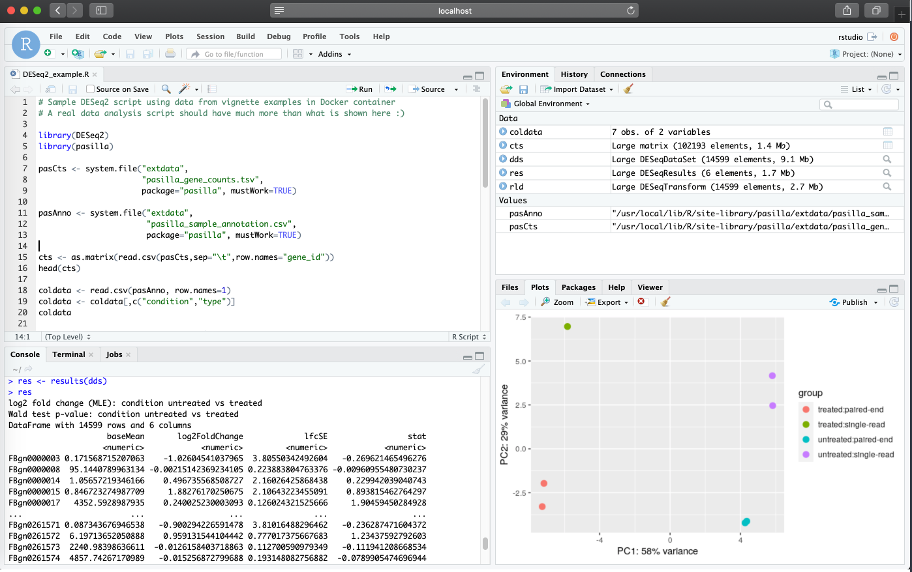
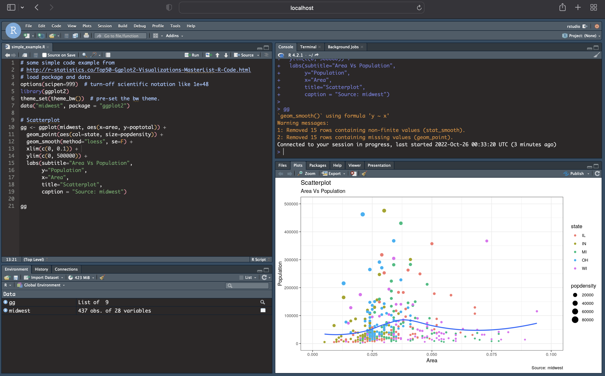

# Requirements

Review part 1 available in this website.

# Build an image with dependencies from Bioconductor

Recently, Bioconductor adopted a new container architecture which streamlines using Docker with Bioconductor packages.

Directly from Bioconductor's documentation, which I highly recommend to read (http://bioconductor.org/help/docker/), the following should be noted:


> __Goals for new container architecture__<br>
> A few of our key goals to migrate to a new set of Docker containers are,
> * to keep the image size being shipped by the Bioconductor team at a manageable size.
> * easy to extend, so developers can just use a single image to inherit and build their docker image.
> * easy to maintain, by streamlining the docker inheritance chain.
> * Adopt a “best practices” outline so that new community contributed docker images get reviewed and follow standards.
> * Adopt a deprecation policy and life cycle for images similar to Bioconductor packages.
> * Replicate the Linux build machines (malbec2) on the bioconductor/bioconductor_docker:devel image as closely as possible. While this is not fully possible just yet, this image can be used by maintainers who wish to reproduce errors seen on the Bioconductor Linux build machine and as a helpful debugging tool.

Further:

> __Current Containers__<br>
> For each supported version of Bioconductor, we provide:
> * __bioconductor/bioconductor_docker:RELEASE_X_Y__
> * __bioconductor/bioconductor_docker:devel__

Thus, if you have package dependencies from Bioconductor, it's highly recommended to use the Bioconductor container which are built using rocker rstudio containers (see the `FROM` directive in the [Bioconductor Dockerfile](https://hub.docker.com/r/bioconductor/bioconductor_docker/dockerfile)). This streamlined resource saves effort for users from having to troubleshoot potential issues that might arise from using Bioconductor resources in Docker (e.g.: missing Bioconductor dependencies).

__NOTE__: As mentioned above, Biconductor containers are released based on Bioconducor releases (`bioconductor/bioconductor_docker:RELEASE_X_Y`), keeping in mind that each bioconductor release is linked to specific R versions. Thus, when choosing a container repository, use the following release history to track down R versions compatible with the Bioconductor releases: https://www.bioconductor.org/about/release-announcements/

The following defines the Dockerfile with Bioconductor release 3.10 (linked to R version 3.6), along with installations (with `BiocManager::install`) for Bioconductor packages `DESeq2` and `pasilla`. I am also adding a few CRAN packages via the standard R install function `install.packages` to simply demonstrate that you can still install any non-bioconductor dependencies in the same form you would normally do without using the Bioconductor parent image.

```docker
FROM bioconductor/bioconductor_docker:RELEASE_3_10

# LABEL adds metadata to an image:
LABEL maintainer="Lara Ianov <lianov@uab.edu>"
LABEL description="An environment for running DESeq2 from Bioconductor 3.10"

# a location to mount ...(again optional to do this in the Dockerfile)
RUN mkdir /home/rstudio/DESeq2_analysis

# Install Bioconductor and other commonly used CRAN packages in DESeq2...
# NOTE that you can install CRAN packages with BiocManager::install, but below
# installing CRAN with install.packages as example
RUN R -e 'BiocManager::install(c("DESeq2", "pasilla"))'
RUN R -e 'install.packages(c("readr","ggrepel","pheatmap"))'
```

Note I have added the `LABEL` directive. This adds metadata to the image which can be fetched with `docker image inspect` command. While not required, it can be helpful to add relevant information in this field.

Now build the image and run the container in the same form as shown in Part 1 (once again assuming you are in the directory which contains the Dockerfile shown in this part. You can find it at the `./src/intro_to_docker_part2` of the [GitHub repository which contains this material](https://github.com/U-BDS/training_guides/tree/main/src)):

```bash
docker build --rm --force-rm -t rstudio_deseq2:3.10 .
```

```bash
docker run -d --rm -p 8787:8787 -e PASSWORD=NBI -v `pwd`/dir_for_mounting:/home/rstudio/DESeq2_analysis rstudio_deseq2:3.10
```

(For this example I am adding the R analysis script to `dir_for_mounting` instead of copying it to the container with the `COPY` directive. Further as we are using the `pasilla` dataset, there is no external data here, but this directory could also be used to add your own datasets.)

The RStudio session is now available at `localhost:8787`



# Pushing images to Docker Hub

To easily share your images with others, use [Docker Hub](https://hub.docker.com/) as the registry to distribute publish images. I recommend to read [Docker Getting Started documentation on Sharing the application](https://docs.docker.com/get-started/04_sharing_app/) if you have not done so, but here, I briefly cover the steps to publish the Bioconductor image which was just created:

1. Create a repository in Docker Hub by navigating to  "Repositories > Create". Provide a name and click "Create". Note that images must be namespaced correctly to be shared in Docker Hub following: `<Your Docker ID>/<Repository Name>:<tag>`

2. Tag and push the image:

```bash
docker tag rstudio_deseq2:3.10 <Your Docker ID>/rstudio_deseq2:3.10
```

```bash
docker push <Your Docker ID>/rstudio_deseq2:3.10
```

3. Add any documentation necessary in the README section under "Manage Repository".

The same container we created in this session is available at: https://hub.docker.com/r/lianov/rstudio_deseq2

# Inspecting an image history

A very useful command to your own images and others publicly available is `docker history` (https://docs.docker.com/engine/reference/commandline/history/). It allows you to inspect the history of the image, including the specific commands called from the Dockerfile. `docker history --no-trunc <image:tag>` expands the outputs for further details.

# Using a custom RStudio preference file (RStudio >=1.3)

By default, RStudio containers are launched with the default RStudio defaults as seen in the figures discussed in the above sections. 

__As of RStudio v1.3__, for a more customized experience (where you may want to set a different RStudio behavior for rmarkdown documents, syntax highlight preferences, custom panel locations, themes etc.), you can bind a custom RStudio preference JSON file (`rstudio-prefs.json`) to automatically apply preferences specified in the JSON file. An example json file can be found in the [GitHub of this training guide](https://github.com/U-BDS/training_guides/blob/main/rstudio-prefs.json), however, if you already have set preferences in your personal computer, you may likely find one in RStudio's default location in your computer (e.g.: `$HOME/.config/rstudio/rstudio-prefs.json`)

The following is an example run where the `rstudio-prefs.json` is used to automatically apply personal preferences with a sample screenshot shown below the command. In this case, some noticeable changes are: theme, syntax highlights, and panel locations. However, additional functionality set by the json file is also present in this session (note we do __not__ use the sample container built above `rstudio_deseq2:3.10`, as the RStudio version of that container is < 1.3 ; this functionality requires image with RStudio >=1.3):

```bash
docker run -d --rm -p 8787:8787 -e PASSWORD=NBI -v $HOME/.config/rstudio/rstudio-prefs.json:/home/rstudio/.config/rstudio/rstudio-prefs.json rocker/rstudio:latest
```



# Additional Notes

* rocker/rstudio does not currently work with arm Macs/Macs with the M1 chip. This is a known issue and will be resolved in an rstudio update in 2023. We are actively watching this issue and will update this guide once the fix becomes available. If you are experiencing this issue, there are some alternative approaches that can be taken, but go beyond the scope of this tutorial and we would be happy to discuss the approach that fits your needs best in Data Science Office Hours (Data Science Office Hours are listed on the home page).
  * Linked below are a couple github issues that are worth noting and watching because they currently track this issue:
    1. https://github.com/rocker-org/rocker-versioned2/issues/259
    2. https://github.com/rocker-org/rocker-versioned2/issues/144
    3. https://github.com/rocker-org/rocker/issues/429
    
* Be aware of disk space for Docker images. When pulling images, they can easily add up to a substantial number if left unchecked. Users can limit available disk space for Docker through the advanced settings. Furthermore, be aware of Docker's cache space. When needed, users can free up disk space from cache using the `docker builder prune` command (e.g.: `docker builder prune -af` would remove everything, thus push your images to Docker Hub first!)

# Additional Docker Learning Resources

* By default, Docker uses only a subset of your computational resources available. See the following for more information on how to change the settings such as assigning more memory: https://stackoverflow.com/questions/44533319/how-to-assign-more-memory-to-docker-container

* The following tutorial covers some of the basics we also covered, but it also briefly discussing how to use Docker in AWS: https://mdneuzerling.com/post/user-getting-started-with-r-and-docker/


* You may also consider using package installation methods that also specify a package version if needed (just check `sessionInfo()` once you load the packages during initial build):

```docker
RUN R -e "install.packages('remotes'); \
  remotes::install_version('<package_name>', '<package_version>')"
```

This is usually only needed for sources like CRAN, since Bioconductor follows a release schedule with packages being linked to specific releases.

* Ten simple rules for writing Dockerfiles for reproducible data science: https://doi.org/10.1371/journal.pcbi.1008316

__Continue tutorial to part 3 from the drop down menu at the navigation bar of this website. This section will cover running RStudio containers in the UAB HPC with Singularity__
