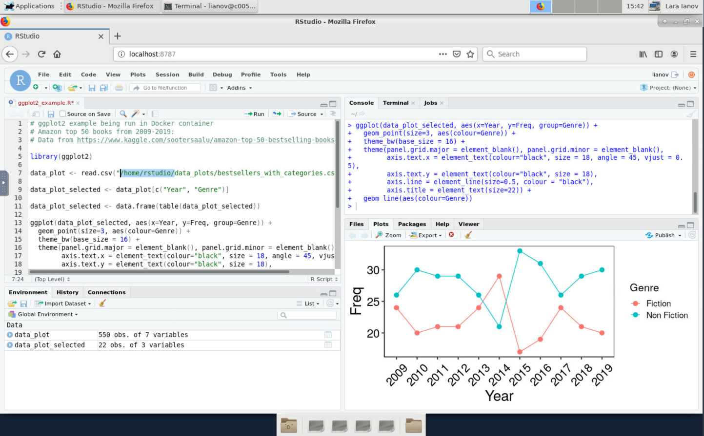

# Requirements

Review part 1 and 2 available in this website.

# Brief background

So far, everything has been run in my local Mac with Docker. However, for large datasets, a user may need computational resources which exceed a personal computer.

Yet, a requirement for running Docker containers is `sudo` privilege which not available to users in a shared system such as HPC. For this reason, users should use [Singularity](https://sylabs.io/docs/) when running containers in HPC. But if that's the case, you may wonder why did we cover Docker up until now?

A short answer to this question is that Docker is a more popular tool than Singularity and thus, there are more resources available to Docker. Furthermore, Docker is compatible with many container technology including Singularity. Therefore, a user can easily develop a Docker container and convert it to Singularity. Importantly, if you do choose to use Singularity for development, you will still need sudo privilege during the original image development as opposed to simply running the container where sudo privilege is not needed. [For a more detailed overview check our this post by Itamar Turner-Trauring.](https://pythonspeed.com/articles/containers-filesystem-data-processing/)

# Running a container at the UAB HPC cluster, Cheaha

Since we will need to connect to RStudio in a web browser, we will launch Singularity within a VNC Session:

1. Login to OnDemand: https://rc.uab.edu
2. Go to "Interactive Apps > HPC Desktop"
3. Choose your computational resources (e.g.: hours, partition etc.) and click "Launch"
4. Once the session is running, click "Launch Desktop in new tab"
5. Open the terminal in the VNC session ("Applications > Terminal Emulator or right-click the desktop and choose terminal).
6. Load Singularity, in this case we are loading the latest version available in HPC which is `Singularity/3.5.2-GCC-5.4.0-2.26`

```
module load Singularity
```

```
module list

Currently Loaded Modules:
  1) shared           4) gcc/8.2.0       7) binutils/2.26-GCCcore-5.4.0  10) Singularity/3.5.2-GCC-5.4.0-2.26
  2) rc-base          5) slurm/18.08.9   8) GCC/5.4.0-2.26
  3) DefaultModules   6) GCCcore/5.4.0   9) Go/1.13.1

```

7. Go to a directory where you would like to place the image and pull the image from Docker Hub. In this case, we will pull the ggplot2 image that was generated in part 1 available at https://hub.docker.com/r/lianov/rstudio_ggplot2. When we pull from docker, Singularity will already convert the image. Note that you must use the following syntax: `docker://user/image:tag` ([see the docs for more](https://sylabs.io/guides/3.5/user-guide/cli/singularity_pull.html))

```bash
cd $USER_SCRATCH
mkdir HPC_container_session
cd HPC_container_session

# Pull from Docker (NOTE the `docker://`)

singularity pull docker://lianov/rstudio_ggplot2:3.6.3
```

This may take a few minutes, but after pulling and unpacking you should see:

```
INFO:    Creating SIF file...
INFO:    Build complete: rstudio_ggplot2_3.6.3.sif
```

8. Start the container. The Rocker project describes this process quite well for RStudio (https://www.rocker-project.org/use/singularity/), and this is what we follow:

```bash
PASSWORD='NBI' singularity exec rstudio_ggplot2_3.6.3.sif rserver --auth-none=0  --auth-pam-helper-path=pam-helper --www-address=127.0.0.1
```

9. Open the browser in the VNC session ("Applications > Web Browser) and go to `http://localhost:8787`

10. Importantly, in Singularity, you will want to use your Cheaha ID as the username to login with the password that was provided above which you can change. Unlike Docker which is fully isolated, Singularity is more integrated with the host filesystem (and it automatically mounts `$HOME`, `$PWD` and `/tmp`).

Further, any data and directories that were copied in the Dockerfile to `/home/rstudio` such as `/home/rstudio/data_plots` are still available in the same path even with your Cheaha ID (this is also true in Docker if you change the user name to another one using `-e USER=<username>`).

Thus, in my Singularity session, I can re-create the ggplot2 plot that was generated in Part 1 using the data in the container from the rstudio username:



*****
# Mounting a directory to the container

As briefly mentioned, Singularity already mounts specific paths ([see docs](https://sylabs.io/guides/3.5/user-guide/bind_paths_and_mounts.html?%20bind#bind-paths-and-mounts)), but if you would like to mount a specific path to the container, you may do so in the similar method to Docker where we mount a path from host to a target path on the container with `--bind $USER_SCRATCH/HPC_path_mount:/home/rstudio/data_mount` (you can choose another target path) :

```bash
PASSWORD='NBI' singularity exec --bind $USER_SCRATCH/HPC_path_mount:/home/rstudio/data_mount rstudio_ggplot2_3.6.3.sif rserver --auth-none=0  --auth-pam-helper-path=pam-helper --www-address=127.0.0.1
```

Or you may also mount the host path directly without a target path in the container with just `--bind $USER_SCRATCH/HPC_path_mount`

```bash
PASSWORD='NBI' singularity exec --bind $USER_SCRATCH/HPC_path_mount rstudio_ggplot2_3.6.3.sif rserver --auth-none=0  --auth-pam-helper-path=pam-helper --www-address=127.0.0.1
```
# Singularity cache

The containers are cached in `$USER_DATA/.singularity`. To list them you may use `singularity cache list -v`. To remove, use the `singularity cache clean` command (see `singularity cache clean -h` for more details). I recommend to use the dry-run flag before running the clean command (`singularity cache clean -n`)


# A note for other use-cases

For this session we have focused on utilizing containers with an active RStudio session as many R analysis are interactive. However, it's important to emphasize, that a user can also run a container (Docker or Singularity) for other purposes, such as running a command within the container:

Using my locally cached Bioconductor container, I can run a simple Linux command:

```bash
docker run --rm bioconductor/bioconductor_docker:RELEASE_3_10 echo Hello World
```

Or a simple R computation:

```bash
docker run -it --rm bioconductor/bioconductor_docker:RELEASE_3_10 R -e '(5 + 8) * 2 == 26'

# ... output
> (5 + 8) * 2 == 26
[1] TRUE
```

Similarly, this can also be accomplished with Singularity in Cheaha. For an overview of using Singularity containers for this purpose, please see the following: https://docs.uabgrid.uab.edu/wiki/Singularity_containers

# Singularity troubleshooting tips

The tutorial above provides a synopsis of the introduction to Singularity, however, we note that using Singularity can sometimes lead to a number of errors which are linked to key differences between Singularity and Docker. In this section, we illustrate a number of these issues, and provide solutions to them. To aid in the implementation of the solution, we are providing [this helper script which is hosted in the GitHub repository of this training guide](https://github.com/U-BDS/training_guides/blob/main/run_rstudio_singularity.sh) 

## `run_rstudio_singularity.sh`

1. Either git clone the main branch of this guide (<https://github.com/U-BDS/training_guides>), or download the helper script directly. Ensure it's executable (`chmod +x`)

2. Ensure you have a Singularity image e.g.: run `singularity pull` from a docker repository as shown earlier.

3. Start your singularity run by providing the following parameters in a compute node in a VNC session:

```
USAGE: ./run_rstudio_singularity.sh -s SINGULARITY_IMAGE -p PASSWORD -u SERVER_USER [-m SINGULARITY_MODULE] [-w PORT] [-b "DIR_BINDS"] [--server-data-dir]

A helper script to execute RStudio Singularity containers

options:
    -s (Required) The singularity image
    -p (Required) The password for your RStudio container
    -u (Required) The server username. Typically the same as $USER
    -m (Optional) The Singularity module to load (Default: Singularity/3.5.2-GCC-5.4.0-2.26)
    -w (Optional) The port number to RStudio container (Default: 8787)
    -b (Optional) Directory to bind. Can be specified multiple times to bind additional directories
    --server-data-dir (Optional) Use --server-data-dir param of rserver; typically available to rocker/rstudio tags > 4.0.0 (Default: false)

```

Example:

For a Singularity image that is linked to R > 4.0.0 with RStudio, we can start the container with the following:

```bash
./run_rstudio_singularity.sh -s rstudio_4.0.4.sif -p "NBI" -u $USER --server-data-dir
```

Expected output will be:

```
Will append the following binding commands: --bind /data/temporary-scratch/lianov/singularity_test/singularity_tmp_dir 
 
---- Initiating singularity exec ---- 
---- Go to http://localhost:8787 to visit your RStudio session ---- 
---- To stop the container, exit this script (e.g. ctrl+C)---- 
```

__NOTE__: we pass in `--server-data-dir` which is only typically available to rocker/rstudio tags > 4.0.0; if you have an error that this parameter is not available, then your underlying `rserver` command in your container doesn't contain this flag. For example, for the image `rstudio_ggplot2_3.6.3.sif`, you would start the container by:

```bash
./run_rstudio_singularity.sh -s rstudio_ggplot2_3.6.3.sif -p "NBI" -u $USER
```

### Binding directories

In this helper script we have disabled a number of Singularity auto-mounts. Thus, you will need to pass in any directories to be mounted with `-b`, each directory having its own `-b` parameter

```bash
# here we mount $USER_DATA and the current working directory (along rstudio --server-data-dir)
# Note that since we are binding two directories, there are two '-b' parameters

./run_rstudio_singularity.sh -s rstudio_4.0.4.sif -p "NBI" -u $USER -b $USER_DATA -b `pwd` --server-data-dir
```

```
Will append the following binding commands: --bind /data/temporary-scratch/lianov/singularity_test/singularity_tmp_dir --bind /data/user/lianov --bind /data/temporary-scratch/lianov/singularity_test 
 
---- Initiating singularity exec ---- 
---- Go to http://localhost:8787 to visit your RStudio session ---- 
---- To stop the container, exit this script (e.g. ctrl+C)---- 
```

__NOTE__: due to an issue we have encountered (see [issue #15](https://github.com/U-BDS/training_guides/issues/15)), the home directory cannot be mounted through the helper script (this is linked to the use of `--containall`, see more at <https://sylabs.io/guides/3.1/user-guide/bind_paths_and_mounts.html#containall>). Thus, if you have any files in `$HOME`, which should be available in the container, simply move them to any other directory which is mounted such as the current working directory.

### Port number

An optional flag (`-w`) is available if port 8787 is busy.

## Solutions from `run_rstudio_singularity.sh`

For clarity in the choice of parameters and other tasks within the helper script, the following section highlights the sections of the script with metadata (__`Solution_#` as a comment__) to the error we have encountered in the table below:

<details><summary>Click here to expand __subset of `run_rstudio_singularity.sh`__</summary>

```bash
#######################
### PRE-REQUIREMENTS ##
#######################
# All files, directories etc. below are to avoid specific Singularity errors identified
# For more details see troubleshooting tips at: 
# https://u-bds.github.io/training_guides/intro_to_docker_rstudio_part3.html#Singularity_troubleshooting_tips

mkdir -p run var-lib-rstudio-server rstudio_tmp #Solution_1 and 7 (#7 for rstudio_tmp)

printf 'provider=sqlite\ndirectory=/var/lib/rstudio-server\n' > database.conf #Solution_1

uuid > my_secure_cookie_key #Solution_2 and https://github.com/U-BDS/training_guides/issues/13

#######################
### RUN SINGULARITY ###
#######################

# explicit export the $PASSWORD and $USER environment variable
# see issue #15
export SINGULARITYENV_PASSWORD=$PASSWORD #Solution_3 and https://github.com/U-BDS/training_guides/issues/15
export SINGULARITYENV_USER=$SERVER_USER #Solution_3 and https://github.com/U-BDS/training_guides/issues/15

# launch the container, bind all needed directories etc.
echo -e \
"${yellow} \n---- Initiating singularity exec ---- \
\n---- Go to http://localhost:${PORT} to visit your RStudio session ---- \
\n---- To stop the container, exit this script (e.g. ctrl+C)---- \n ${reset}"

#NOTE: add_bind_params should be first in binding commands
# in case user re-binds pwd/cwd, or path within pwd/cwd

singularity exec \
    --cleanenv \    #Solution_3
    --containall \  #Solution_3
    $add_bind_params \ 
    --bind run:/run,var-lib-rstudio-server:/var/lib/rstudio-server,database.conf:/etc/rstudio/database.conf,rstudio_tmp:/tmp \  #Solution_1 / 7
    --bind $cwd/my_secure_cookie_key \  #Solution_2 
    $SINGULARITY_IMAGE \
    rserver \
    --auth-validate-users=0 \
    --auth-none=0  \
    --auth-pam-helper-path=pam-helper \
    --www-address=127.0.0.1 \
    --secure-cookie-key-file $cwd/my_secure_cookie_key \  #Solution_2 
    --server-user=$SERVER_USER \  #Solution_4
    --www-port $PORT \  #Solution_5
    $server_data_dir    #Solution_6: enables --server-data-dir
```

</details>

___

```{r, echo = FALSE}
metadata_singularity <- read.csv("./src/singularity_error_metadata.csv")

DT::datatable(metadata_singularity,
              options = list(
                  scrollX = TRUE
              ),
              rownames = FALSE)
```


## Additional tips

1. When running more than one RStudio Singularity container:
    * __It's recommended to run the containers in separate working directories.__
    * Although not a requirement, we recommend to launch the container from a separate VNC/HPC Desktop job with its own dedicated computational resources.
    * In HPC VNC, when running containers that need Firefox such as RStudio, they are linked to a default Firefox user. Thus, if more than one session is running the following may occur:

```
Firefox is already running, but is not responding. To open a new window, you must first close the existing Firefox process, or restart your system
```

One solution is outlined in the Firefox user questions: https://support.mozilla.org/en-US/questions/971866 and summarized below:

* Create a separate firefox profile with `firefox -p profilename`. All profiles can be view at `/home/<HPC_id>/.mozilla/firefox`

* That should resolve the issue, but importantly this makes your latest profile set as default. Thus, if you encounter the same error switch to the older existing profile. You can read more about setting default profile for Firefox at: https://support.mozilla.org/en-US/kb/profile-manager-create-remove-switch-firefox-profiles

2. If you encounter `ERROR system error 17 (File exists) [path: /home/$USER/.rstudio, target-dir: ]` followed by message which may state "Unable to connect to service", the cause is likely linked to the `.rstudio` directory located in `$HOME`. Using the helper script we provide above should minimize this since `$HOME` is not mounted, however, we add special emphasis to this error in this guide since it's also referenced in the [UAB RC docs here](https://uabrc.github.io/help/faq/#why-do-i-get-a-gray-screen-after-launching-my-ood-rstudio-server-session) if a user is using the OOD RStudio Server.

# Additional learning resources

* By default, Docker uses only a subset of your computational resources available. See the following for more information on how to change the settings such as assigning more memory: https://stackoverflow.com/questions/44533319/how-to-assign-more-memory-to-docker-container

* The following tutorial covers some of the basics we also covered, but it also briefly discussing how to use Docker in AWS: https://mdneuzerling.com/post/user-getting-started-with-r-and-docker/

* You may also consider using package installation methods that also specify a package version if needed (just check `sessionInfo()` once you load the packages during initial build):

```docker
RUN R -e "install.packages('remotes'); \
  remotes::install_version('<package_name>', '<package_version>')"
```

This is usually only needed for sources like CRAN, since Bioconductor follows a release schedule with packages being linked to specific releases.

* Ten simple rules for writing Dockerfiles for reproducible data science: https://doi.org/10.1371/journal.pcbi.1008316

* If you have issues with R Studio filling up your home directory in HPC, check out the solutions presented by Ming Tang under "Fix home directory filled up issue": https://divingintogeneticsandgenomics.rbind.io/post/run-rstudio-server-with-singularity-on-hpc/
